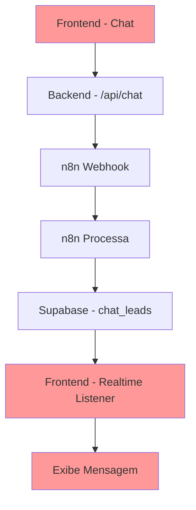
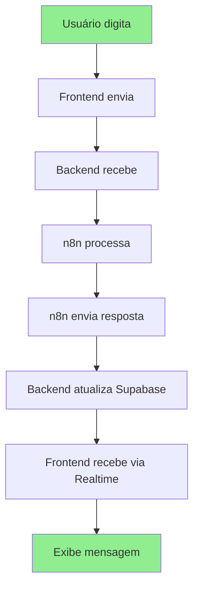

# 🔍 **ANÁLISE DO PROBLEMA: CHAT FLUTUANTE FICA "DIGITANDO..."**

## 📋 **PROBLEMA IDENTIFICADO**

O chat flutuante fica apenas mostrando "Digitando..." e não consegue exibir a resposta final que chega no `send_frontend` com o JSON:

```json
[
  {
    "success": true,
    "data_from_n8n": {
      "output": "{\"response_text\":\"Olá, Jonas! Como posso te ajudar hoje?\"}"
    }
  }
]
```

## 🏗️ **ESTRUTURA ATUAL DO PROJETO**

### **1. Fluxo Atual (PROBLEMÁTICO)**



### **2. Componentes Envolvidos**

#### **Frontend (React)**
- `src/contexts/ChatContext.tsx` - Gerencia estado do chat
- `src/components/chat/ChatWidget.tsx` - Interface do chat
- `src/components/chat/MessageBubble.tsx` - Exibe mensagens
- `src/components/chat/TypingIndicator.tsx` - Mostra "Digitando..."

#### **Backend (Node.js)**
- `api-server.cjs` - Servidor Express
- `/api/chat` - Endpoint que recebe mensagens
- Envia para n8n (fire-and-forget)

#### **Banco de Dados**
- `chat_leads` - Tabela no Supabase
- Realtime subscriptions para atualizações

## 🚨 **PROBLEMAS IDENTIFICADOS**

### **1. Falta de Endpoint para Receber Resposta do n8n**
- ❌ Não existe endpoint `/api/webhook/receive` no backend
- ❌ n8n não tem como enviar resposta de volta
- ❌ Frontend só escuta Supabase Realtime

### **2. Incompatibilidade de Dados**
- ❌ n8n envia JSON estruturado
- ❌ Frontend espera formato simples
- ❌ Parsing incorreto da resposta

### **3. Falta de Tratamento de Erro**
- ❌ Sem timeout para "Digitando..."
- ❌ Sem fallback se n8n falhar
- ❌ Sem retry automático

## 🔧 **SOLUÇÕES PROPOSTAS**

### **SOLUÇÃO 1: Endpoint Webhook no Backend (RECOMENDADA)**

#### **1.1 Criar Endpoint no Backend**
```javascript
// api-server.cjs - ADICIONAR
app.post('/api/webhook/receive', (req, res) => {
    try {
        const { sessionId, response_text } = req.body;
        
        // Atualizar Supabase
        await supabase
            .from('chat_leads')
            .update({ 
                chat_history: [...existingHistory, {
                    role: 'assistant',
                    content: response_text,
                    timestamp: new Date()
                }]
            })
            .eq('session_id', sessionId);
            
        res.status(200).json({ success: true });
    } catch (error) {
        console.error('Erro no webhook:', error);
        res.status(500).json({ error: 'Erro interno' });
    }
});
```

#### **1.2 Configurar n8n para Enviar Resposta**
```json
// n8n - ÚLTIMO NÓ
{
  "sessionId": "{{ $json.sessionId }}",
  "response_text": "{{ $json.response_text }}"
}
```

### **SOLUÇÃO 2: Melhorar Realtime Listener**

#### **2.1 Atualizar ChatContext**
```typescript
// src/contexts/ChatContext.tsx
const listenToChatUpdates = (leadId: string) => {
    const channel = supabase
        .channel(`chat_lead_updates:${leadId}`)
        .on('postgres_changes', {
            event: 'UPDATE',
            schema: 'public',
            table: 'chat_leads',
            filter: `id=eq.${leadId}`,
        }, (payload) => {
            const newHistory = payload.new.chat_history;
            if (newHistory && Array.isArray(newHistory)) {
                const lastMessage = newHistory[newHistory.length - 1];
                
                // Verificar se é uma nova mensagem do bot
                if (lastMessage.role === 'assistant') {
                    addMessage({
                        id: `bot-${Date.now()}`,
                        type: 'bot',
                        content: lastMessage.content,
                        timestamp: new Date(),
                    });
                    setIsLoading(false);
                }
            }
        })
        .subscribe();
};
```

#### **2.2 Adicionar Timeout**
```typescript
// src/contexts/ChatContext.tsx
const sendMessage = async (content: string) => {
    // ... código existente ...
    
    // Adicionar timeout
    const timeoutId = setTimeout(() => {
        setIsLoading(false);
        addMessage({
            id: `timeout-${Date.now()}`,
            type: 'bot',
            content: 'Desculpe, tive um problema técnico. Tente novamente.',
            timestamp: new Date(),
        });
    }, 30000); // 30 segundos
    
    try {
        // ... código existente ...
        clearTimeout(timeoutId);
    } catch (error) {
        clearTimeout(timeoutId);
        // ... tratamento de erro ...
    }
};
```

### **SOLUÇÃO 3: Estrutura de Dados Padronizada**

#### **3.1 Schema do Supabase**
```sql
-- Atualizar tabela chat_leads
ALTER TABLE chat_leads ADD COLUMN IF NOT EXISTS chat_history JSONB DEFAULT '[]';
ALTER TABLE chat_leads ADD COLUMN IF NOT EXISTS last_response TEXT;
ALTER TABLE chat_leads ADD COLUMN IF NOT EXISTS response_timestamp TIMESTAMP;
```

#### **3.2 Formato Padrão de Mensagens**
```json
{
  "chat_history": [
    {
      "role": "user",
      "content": "Olá",
      "timestamp": "2024-01-01T10:00:00Z"
    },
    {
      "role": "assistant", 
      "content": "Olá! Como posso ajudar?",
      "timestamp": "2024-01-01T10:00:01Z"
    }
  ]
}
```

## 🚀 **PLANO DE IMPLEMENTAÇÃO**

### **FASE 1: Correção Imediata (1-2 horas)**
1. ✅ Criar endpoint `/api/webhook/receive` no backend
2. ✅ Configurar n8n para enviar resposta
3. ✅ Adicionar timeout no frontend
4. ✅ Testar fluxo completo

### **FASE 2: Melhorias (2-3 horas)**
1. ✅ Melhorar tratamento de erros
2. ✅ Adicionar retry automático
3. ✅ Implementar fallback
4. ✅ Logs detalhados

### **FASE 3: Otimizações (1-2 horas)**
1. ✅ Cache de mensagens
2. ✅ Debounce no envio
3. ✅ Indicadores de status
4. ✅ Animações suaves

## 📊 **ESTRUTURA VISUAL DO PROJETO**

```
claroai-clarity-engine-main/
├── 📁 Frontend (React + TypeScript)
│   ├── 🎨 src/components/chat/
│   │   ├── ChatWidget.tsx (Interface principal)
│   │   ├── ChatInput.tsx (Input de mensagens)
│   │   ├── MessageBubble.tsx (Exibe mensagens)
│   │   └── TypingIndicator.tsx (Indicador "Digitando...")
│   ├── 🔄 src/contexts/ChatContext.tsx (Estado global)
│   └── 🌐 src/lib/supabase.js (Conexão com banco)
│
├── ⚙️ Backend (Node.js + Express)
│   ├── api-server.cjs (Servidor principal)
│   ├── /api/chat (Recebe mensagens)
│   └── /api/webhook/receive (Recebe resposta n8n) ← NOVO
│
├── 🔗 Integrações
│   ├── n8n (Processamento de IA)
│   ├── Supabase (Banco + Realtime)
│   └── OpenAI (Geração de respostas)
│
└── 📋 Documentação
    ├── SETUP.md
    ├── N8N-WORKFLOW-SETUP.md
    └── WEBHOOK-SETUP.md
```

## 🎯 **RESULTADO ESPERADO**

Após as correções, o fluxo deve funcionar assim:



### **Benefícios:**
- ✅ Resposta em tempo real
- ✅ Tratamento de erros robusto
- ✅ Timeout automático
- ✅ Logs detalhados
- ✅ Fácil manutenção

## 🔧 **PRÓXIMOS PASSOS**

1. **Implementar Solução 1** (Endpoint webhook)
2. **Testar fluxo completo**
3. **Adicionar melhorias de UX**
4. **Documentar mudanças**
5. **Deploy em produção**

---

**Status:** 🚨 **PROBLEMA CRÍTICO - NECESSITA CORREÇÃO IMEDIATA**
**Prioridade:** 🔴 **ALTA**
**Tempo Estimado:** 4-6 horas
**Impacto:** Usuários não conseguem usar o chat 