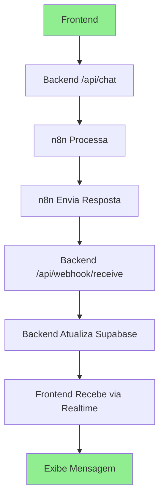

# 🔄 **CONFIGURAÇÃO N8N: ENVIAR RESPOSTA DE VOLTA**

## 📋 **PROBLEMA RESOLVIDO**

Agora que criamos o endpoint `/api/webhook/receive` no backend, precisamos configurar o n8n para enviar a resposta de volta.

## 🎯 **FLUXO CORRIGIDO**



## ⚙️ **CONFIGURAÇÃO DO N8N**

### **PASSO 1: Adicionar Nó HTTP Request**

Após o nó que processa a resposta (OpenAI, etc.), adicione um novo nó:

**Tipo:** HTTP Request  
**Método:** POST  
**URL:** `http://localhost:3001/api/webhook/receive` (ou sua URL de produção)

### **PASSO 2: Configurar Payload**

No nó HTTP Request, configure o **Body** com:

```json
{
  "sessionId": "{{ $json.sessionId }}",
  "response_text": "{{ $json.response_text }}",
  "data_from_n8n": {
    "output": "{{ $json.output }}"
  }
}
```

### **PASSO 3: Exemplo Completo do Workflow**

```json
{
  "nodes": [
    {
      "id": "webhook-trigger",
      "type": "n8n-nodes-base.webhook",
      "position": [240, 300],
      "parameters": {
        "httpMethod": "POST",
        "path": "chat-message",
        "responseMode": "responseNode"
      }
    },
    {
      "id": "openai-process",
      "type": "n8n-nodes-base.openAi",
      "position": [460, 300],
      "parameters": {
        "operation": "chatCompletion",
        "model": "gpt-4",
        "messages": {
          "messageValues": [
            {
              "role": "system",
              "content": "Você é a Clara, assistente virtual da ClaroAI. Seja amigável e profissional."
            },
            {
              "role": "user",
              "content": "{{ $json.mensagem_do_usuario }}"
            }
          ]
        }
      }
    },
    {
      "id": "send-response-back",
      "type": "n8n-nodes-base.httpRequest",
      "position": [680, 300],
      "parameters": {
        "method": "POST",
        "url": "http://localhost:3001/api/webhook/receive",
        "sendHeaders": true,
        "headerParameters": {
          "parameters": [
            {
              "name": "Content-Type",
              "value": "application/json"
            }
          ]
        },
        "sendBody": true,
        "bodyParameters": {
          "parameters": [
            {
              "name": "sessionId",
              "value": "{{ $('webhook-trigger').item.json.sessionId }}"
            },
            {
              "name": "response_text",
              "value": "{{ $('openai-process').item.json.choices[0].message.content }}"
            },
            {
              "name": "data_from_n8n",
              "value": "{{ { \"output\": $('openai-process').item.json.choices[0].message.content } }}"
            }
          ]
        }
      }
    }
  ],
  "connections": {
    "webhook-trigger": {
      "main": [
        [
          {
            "node": "openai-process",
            "type": "main",
            "index": 0
          }
        ]
      ]
    },
    "openai-process": {
      "main": [
        [
          {
            "node": "send-response-back",
            "type": "main",
            "index": 0
          }
        ]
      ]
    }
  }
}
```

## 🔧 **CONFIGURAÇÕES ESPECÍFICAS**

### **Para Desenvolvimento Local:**
```json
{
  "url": "http://localhost:3001/api/webhook/receive"
}
```

### **Para Produção:**
```json
{
  "url": "https://seu-dominio.com/api/webhook/receive"
}
```

### **Headers Recomendados:**
```json
{
  "Content-Type": "application/json",
  "User-Agent": "n8n-claroai/1.0"
}
```

## 📊 **FORMATOS DE RESPOSTA SUPORTADOS**

O endpoint `/api/webhook/receive` suporta múltiplos formatos:

### **Formato 1: Simples**
```json
{
  "sessionId": "abc123",
  "response_text": "Olá! Como posso ajudar?"
}
```

### **Formato 2: Estruturado (como você mencionou)**
```json
{
  "sessionId": "abc123",
  "data_from_n8n": {
    "output": "{\"response_text\":\"Olá, Jonas! Como posso te ajudar hoje?\"}"
  }
}
```

### **Formato 3: Misto**
```json
{
  "sessionId": "abc123",
  "response_text": "Olá! Como posso ajudar?",
  "data_from_n8n": {
    "output": {
      "response_text": "Olá, Jonas! Como posso te ajudar hoje?",
      "metadata": {
        "confidence": 0.95,
        "processing_time": 1.2
      }
    }
  }
}
```

## 🧪 **TESTE DO WORKFLOW**

### **1. Teste Manual**
1. Acesse o n8n
2. Execute o workflow manualmente
3. Use dados de teste:
```json
{
  "sessionId": "test-session-123",
  "mensagem_do_usuario": "Olá"
}
```

### **2. Verificar Logs**
No terminal do backend, você deve ver:
```
📨 Webhook recebido do n8n: { sessionId: 'test-session-123', ... }
✅ Resposta processada: Olá! Como posso ajudar?
💾 Atualizando Supabase para sessionId: test-session-123
```

### **3. Teste Completo**
1. Abra o chat no frontend
2. Digite uma mensagem
3. Verifique se a resposta aparece
4. Confirme que o "Digitando..." para

## 🚨 **TRATAMENTO DE ERROS**

### **Erros Comuns e Soluções:**

#### **1. CORS Error**
```
Access to fetch at 'http://localhost:3001/api/webhook/receive' from origin 'http://localhost:8081' has been blocked by CORS policy
```
**Solução:** O backend já tem CORS configurado, verifique se está rodando.

#### **2. Connection Refused**
```
Failed to fetch: net::ERR_CONNECTION_REFUSED
```
**Solução:** Verifique se o backend está rodando na porta 3001.

#### **3. Timeout**
```
Request timeout after 30 seconds
```
**Solução:** Verifique se o n8n está processando corretamente.

## 📝 **LOGS IMPORTANTES**

### **Backend (api-server.cjs):**
```javascript
console.log("📨 Webhook recebido do n8n:", req.body);
console.log("✅ Resposta processada:", finalResponseText);
console.log("💾 Atualizando Supabase para sessionId:", sessionId);
```

### **Frontend (ChatContext):**
```javascript
console.log('✅ Mensagem enviada com sucesso:', data);
console.log('[REALTIME] Mudança recebida do Supabase!', payload);
console.warn('⏰ Timeout: Nenhuma resposta recebida em 30 segundos');
```

## 🎯 **RESULTADO ESPERADO**

Após a configuração:

1. ✅ Usuário digita mensagem
2. ✅ Frontend envia para backend
3. ✅ Backend envia para n8n
4. ✅ n8n processa com IA
5. ✅ n8n envia resposta de volta
6. ✅ Backend atualiza Supabase
7. ✅ Frontend recebe via Realtime
8. ✅ Mensagem aparece no chat
9. ✅ "Digitando..." para

## 🔄 **PRÓXIMOS PASSOS**

1. **Configurar n8n** seguindo este guia
2. **Testar workflow** completo
3. **Verificar logs** em todos os pontos
4. **Ajustar timeouts** se necessário
5. **Deploy em produção**

---

**Status:** 🟡 **EM CONFIGURAÇÃO**
**Prioridade:** 🔴 **ALTA**
**Tempo Estimado:** 30-60 minutos
**Dependências:** Backend com endpoint webhook 