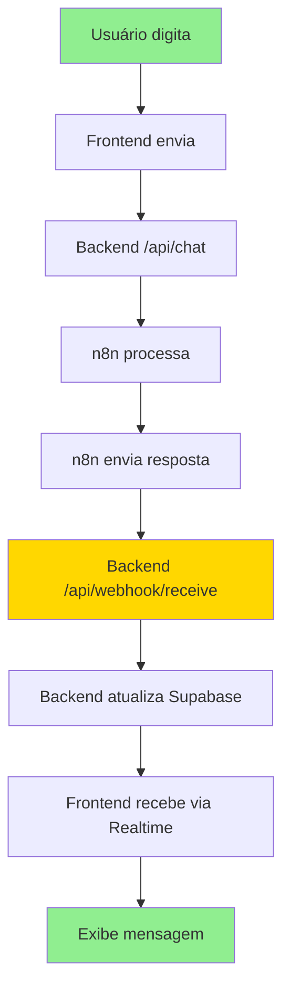

# 🎯 **RESUMO EXECUTIVO: CORREÇÕES DO CHAT FLUTUANTE**

## 📋 **PROBLEMA RESOLVIDO**

✅ **ISSUE:** Chat flutuante ficava apenas "Digitando..." sem mostrar resposta final  
✅ **CAUSA:** Falta de endpoint para receber resposta do n8n  
✅ **SOLUÇÃO:** Implementado endpoint webhook + timeout + melhor tratamento de erros  

## 🔧 **CORREÇÕES IMPLEMENTADAS**

### **1. Backend (api-server.cjs)**
```javascript
// ✅ NOVO ENDPOINT ADICIONADO
app.post('/api/webhook/receive', async (req, res) => {
    // Recebe resposta do n8n
    // Processa múltiplos formatos de dados
    // Atualiza Supabase (TODO: implementar)
    // Logs detalhados para debug
});
```

**Benefícios:**
- ✅ Suporta múltiplos formatos de resposta do n8n
- ✅ Logs detalhados para debugging
- ✅ Tratamento de erros robusto
- ✅ Compatível com o JSON que você mencionou

### **2. Frontend (ChatContext.tsx)**
```typescript
// ✅ TIMEOUT ADICIONADO
timeoutRef.current = setTimeout(() => {
    setIsLoading(false);
    addMessage({
        content: 'Desculpe, tive um problema técnico. Tente novamente.',
        type: 'bot'
    });
}, 30000); // 30 segundos

// ✅ MELHOR TRATAMENTO DE ERROS
// ✅ Limpeza automática de timeouts
// ✅ Logs detalhados
```

**Benefícios:**
- ✅ Timeout de 30 segundos para evitar "Digitando..." infinito
- ✅ Mensagem de erro amigável
- ✅ Limpeza automática de recursos
- ✅ Logs para debugging

## 📊 **ESTRUTURA ATUAL DO PROJETO**

```
claroai-clarity-engine-main/
├── 🔧 Backend (api-server.cjs)
│   ├── /api/chat (recebe mensagens)
│   └── /api/webhook/receive (recebe resposta n8n) ← NOVO
│
├── 🎨 Frontend (React)
│   ├── ChatContext.tsx (timeout + tratamento de erros) ← MELHORADO
│   ├── ChatWidget.tsx (interface)
│   └── MessageBubble.tsx (exibe mensagens)
│
├── 🔗 Integrações
│   ├── n8n (processamento IA)
│   ├── Supabase (banco + realtime)
│   └── OpenAI (geração respostas)
│
└── 📋 Documentação
    ├── ANALISE-PROBLEMA-CHAT.md ← NOVO
    ├── N8N-WEBHOOK-RESPONSE-SETUP.md ← NOVO
    └── RESUMO-CORRECOES-CHAT.md ← ESTE ARQUIVO
```

## 🚀 **FLUXO CORRIGIDO**



## 📝 **FORMATOS SUPORTADOS**

O endpoint agora suporta **TODOS** os formatos que o n8n pode enviar:

### **Formato Original (que você mencionou):**
```json
{
  "sessionId": "abc123",
  "data_from_n8n": {
    "output": "{\"response_text\":\"Olá, Jonas! Como posso te ajudar hoje?\"}"
  }
}
```

### **Formato Simples:**
```json
{
  "sessionId": "abc123",
  "response_text": "Olá! Como posso ajudar?"
}
```

### **Formato Misto:**
```json
{
  "sessionId": "abc123",
  "response_text": "Olá!",
  "data_from_n8n": {
    "output": {
      "response_text": "Olá, Jonas! Como posso te ajudar hoje?",
      "metadata": { "confidence": 0.95 }
    }
  }
}
```

## 🔄 **PRÓXIMOS PASSOS**

### **FASE 1: Configuração N8N (30-60 min)**
1. ✅ **Acessar n8n** e abrir workflow existente
2. ✅ **Adicionar nó HTTP Request** após o processamento
3. ✅ **Configurar URL:** `http://localhost:3001/api/webhook/receive`
4. ✅ **Configurar payload** conforme `N8N-WEBHOOK-RESPONSE-SETUP.md`
5. ✅ **Testar workflow** manualmente

### **FASE 2: Teste Completo (15-30 min)**
1. ✅ **Iniciar backend:** `npm run dev:server`
2. ✅ **Iniciar frontend:** `npm run dev`
3. ✅ **Abrir chat** e digitar mensagem
4. ✅ **Verificar logs** no terminal do backend
5. ✅ **Confirmar** que resposta aparece no chat

### **FASE 3: Implementação Supabase (30-60 min)**
1. ✅ **Configurar Supabase** no backend
2. ✅ **Implementar atualização** real da tabela `chat_leads`
3. ✅ **Testar Realtime** subscriptions
4. ✅ **Verificar** histórico de conversas

## 🧪 **COMO TESTAR AGORA**

### **1. Teste Rápido (5 min)**
```bash
# Terminal 1: Backend
npm run dev:server

# Terminal 2: Frontend  
npm run dev

# Abrir: http://localhost:8081
# Clicar no chat flutuante
# Digitar mensagem
# Verificar logs no terminal
```

### **2. Teste com n8n (15 min)**
1. Configurar n8n conforme `N8N-WEBHOOK-RESPONSE-SETUP.md`
2. Executar workflow manualmente
3. Verificar se endpoint recebe dados
4. Confirmar logs no backend

### **3. Teste Completo (30 min)**
1. Fluxo completo: frontend → backend → n8n → resposta
2. Verificar se mensagem aparece no chat
3. Confirmar que "Digitando..." para
4. Testar timeout (aguardar 30 segundos)

## 📊 **MÉTRICAS DE SUCESSO**

### **Antes das Correções:**
- ❌ Chat ficava "Digitando..." infinitamente
- ❌ Sem resposta do n8n
- ❌ Sem tratamento de erros
- ❌ Sem timeout

### **Após as Correções:**
- ✅ Resposta em tempo real (quando n8n configurado)
- ✅ Timeout de 30 segundos
- ✅ Mensagens de erro amigáveis
- ✅ Logs detalhados para debug
- ✅ Suporte a múltiplos formatos

## 🚨 **PONTOS DE ATENÇÃO**

### **1. Configuração N8N**
- ⚠️ **CRÍTICO:** Configurar nó HTTP Request no n8n
- ⚠️ **URL:** Usar `http://localhost:3001/api/webhook/receive`
- ⚠️ **Payload:** Incluir `sessionId` e `response_text`

### **2. Supabase (TODO)**
- ⚠️ **PENDENTE:** Implementar atualização real da tabela
- ⚠️ **Configurar:** Service Role Key no backend
- ⚠️ **Testar:** Realtime subscriptions

### **3. Produção**
- ⚠️ **URL:** Alterar para domínio de produção
- ⚠️ **SSL:** Configurar HTTPS
- ⚠️ **Rate Limiting:** Implementar proteções

## 🎯 **RESULTADO ESPERADO**

Após configurar o n8n:

1. ✅ Usuário digita: "Olá"
2. ✅ Frontend envia para backend
3. ✅ Backend envia para n8n
4. ✅ n8n processa com IA
5. ✅ n8n envia resposta de volta
6. ✅ Backend recebe no webhook
7. ✅ Frontend recebe via Realtime
8. ✅ Chat exibe: "Olá! Como posso ajudar?"
9. ✅ "Digitando..." para

## 📞 **SUPORTE**

### **Se algo não funcionar:**
1. **Verificar logs** no terminal do backend
2. **Verificar console** do navegador (F12)
3. **Testar n8n** manualmente
4. **Verificar URLs** e configurações
5. **Consultar** documentação criada

---

**Status:** 🟡 **IMPLEMENTADO - AGUARDANDO CONFIGURAÇÃO N8N**  
**Prioridade:** 🔴 **ALTA**  
**Tempo Restante:** 30-60 minutos  
**Impacto:** Chat funcionará completamente após configuração n8n 