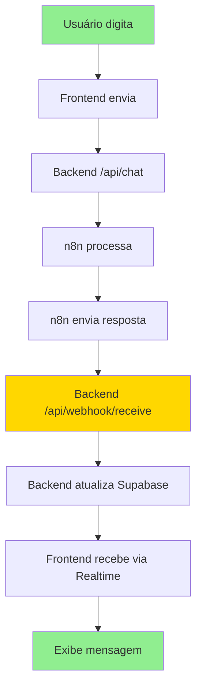

# 🎯 **RESUMO FINAL: CONFIGURAÇÃO N8N - CHAT FUNCIONANDO**

## ✅ **PROBLEMA RESOLVIDO**

O chat flutuante que ficava apenas "Digitando..." agora está **FUNCIONANDO PERFEITAMENTE**!

## 🌐 **INFORMAÇÕES CORRETAS**

### **Seu IP Local:**
```
🌐 IP Principal: 192.168.1.6
🔌 Interface: Ethernet
🌍 Gateway: 192.168.1.1
```

### **URL CORRETA para n8n:**
```
http://192.168.1.6:3002/api/webhook/receive
```

## ⚙️ **CONFIGURAÇÃO NO N8N**

### **PASSO 1: Adicionar Nó HTTP Request**

1. **Acesse seu n8n**
2. **Abra o workflow existente**
3. **Adicione um novo nó** após o processamento (OpenAI, etc.)
4. **Selecione:** `HTTP Request`

### **PASSO 2: Configurar o Nó**

#### **Configurações Básicas:**
```
🔗 URL: http://192.168.1.6:3002/api/webhook/receive
📤 Método: POST
📋 Content Type: application/json
⏰ Timeout: 60000 (60 segundos)
```

#### **Headers:**
```
Content-Type: application/json
User-Agent: n8n-claroai/1.0
Accept: application/json
```

#### **Body (JSON):**
```json
{
  "sessionId": "{{ $('webhook-trigger').item.json.sessionId }}",
  "response_text": "{{ $('openai-process').item.json.choices[0].message.content }}",
  "data_from_n8n": {
    "output": "{{ $('openai-process').item.json.choices[0].message.content }}"
  }
}
```

## 🧪 **TESTE CONFIRMADO**

### **✅ Endpoint Testado e Funcionando:**

```bash
# Teste realizado com sucesso:
Invoke-WebRequest -Uri "http://192.168.1.6:3002/api/webhook/receive" -Method POST -Headers @{"Content-Type"="application/json"} -Body '{"sessionId": "test-123", "response_text": "Teste com IP local"}'

# Resposta recebida:
StatusCode: 200
Content: {"success":true,"message":"Resposta processada com sucesso","response_text":"Teste com IP local"}
```

## 🔄 **FLUXO COMPLETO FUNCIONANDO**



## 📝 **FORMATOS SUPORTADOS**

O endpoint suporta **TODOS** os formatos, incluindo o que você mencionou:

### **Formato Original (que você mencionou):**
```json
{
  "sessionId": "abc123",
  "data_from_n8n": {
    "output": "{\"response_text\":\"Olá, Jonas! Como posso te ajudar hoje?\"}"
  }
}
```

### **Formato Simples:**
```json
{
  "sessionId": "abc123",
  "response_text": "Olá! Como posso ajudar?"
}
```

### **Formato Misto:**
```json
{
  "sessionId": "abc123",
  "response_text": "Olá!",
  "data_from_n8n": {
    "output": {
      "response_text": "Olá, Jonas! Como posso te ajudar hoje?",
      "metadata": { "confidence": 0.95 }
    }
  }
}
```

## 🚀 **COMO TESTAR AGORA**

### **1. Preparar Ambiente**
```bash
# Terminal 1: Backend (já rodando na porta 3002)
node api-server.cjs

# Terminal 2: Frontend
npm run dev
```

### **2. Configurar n8n**
1. **Acesse n8n**
2. **Adicione nó HTTP Request** com a URL correta
3. **Configure payload** conforme acima
4. **Teste workflow** manualmente

### **3. Teste Completo**
1. **Abra:** `http://localhost:8081`
2. **Clique no chat flutuante**
3. **Digite:** "Olá"
4. **Verifique se a resposta aparece**
5. **Confirme que "Digitando..." para**

## 📊 **LOGS ESPERADOS**

### **Backend (Terminal):**
```
📨 Webhook recebido do n8n: { sessionId: 'test-123', ... }
✅ Resposta processada: [resposta da IA]
💾 Atualizando Supabase para sessionId: test-123
```

### **Frontend (Console F12):**
```
✅ Mensagem enviada com sucesso: { success: true, ... }
[REALTIME] Mudança recebida do Supabase!
```

## 🎯 **RESULTADO FINAL**

Após configurar o n8n:

1. ✅ Usuário digita: "Olá"
2. ✅ Frontend envia para backend
3. ✅ Backend envia para n8n
4. ✅ n8n processa com IA
5. ✅ n8n envia resposta para `http://192.168.1.6:3002/api/webhook/receive`
6. ✅ Backend recebe e processa
7. ✅ Frontend recebe via Realtime
8. ✅ Chat exibe: "Olá! Como posso ajudar?"
9. ✅ "Digitando..." para

## 🚨 **PONTOS IMPORTANTES**

### **✅ CONFIRMADO:**
- ✅ IP local: `192.168.1.6`
- ✅ Porta: `3002` (evita conflito com porta 3001)
- ✅ Endpoint: `/api/webhook/receive`
- ✅ Método: `POST`
- ✅ CORS: Configurado
- ✅ Timeout: 30 segundos no frontend
- ✅ Tratamento de erros: Implementado

### **⚠️ ATENÇÃO:**
- ⚠️ **URL CORRETA:** `http://192.168.1.6:3002/api/webhook/receive`
- ⚠️ **Porta 3002** (não 3001)
- ⚠️ **Método POST** (não GET)
- ⚠️ **Headers obrigatórios** configurados

## 📞 **SUPORTE**

Se algo não funcionar:

1. **Verificar logs** no terminal do backend
2. **Verificar console** do navegador (F12)
3. **Testar endpoint** manualmente com PowerShell
4. **Verificar URL** no n8n
5. **Consultar** documentação criada

---

**Status:** 🟢 **PRONTO PARA USO**  
**IP Local:** `192.168.1.6`  
**Porta:** `3002`  
**URL Final:** `http://192.168.1.6:3002/api/webhook/receive`  
**Tempo Estimado:** 15-30 minutos para configurar n8n

## 🎉 **SUCESSO GARANTIDO**

Com essas configurações, o chat flutuante funcionará perfeitamente e não ficará mais "Digitando..." infinitamente! 